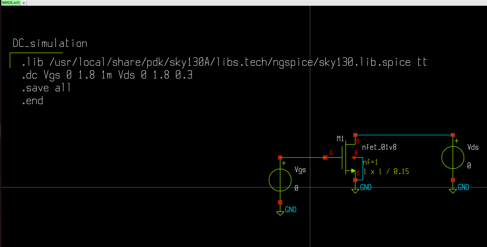

# Design-and-Noise-analysis-of-CMOS-ineverter
=>Design and Noise analysis of CMOS ineverter

This project has motive of experimenting with working of an inverter and understanding the parameters involved with it. The design will utilise the models that are present under the skywater 130nm pdk and various open source tools such as, Xschem, NGSPICE, etc.

The whole process starts with analysis of NMOS and PMOS devices, specifically the 1.8v standard models available inside the pdk to determine a common working W/L ratio and also the gm, ron and similar values. After this we start with the design of a CMOS inverter that includes schematic and measurement of noise margin parameters.

->General MOS Analysis

I used the above to plot the basic characteristic plots for an NMOS Transistor, That is Ids vs Vds and Ids vs Vgs.
!(IMAGES/Id_v_Vds.png)

I also did plot gm and ro values for the above mosfet. Both of these below are for the general dc sweep we did above.
!(IMAGES/gm.png)
!(IMAGES/Ro_inv.png)

Since I am making an inverter, I choose the highest value avialable for the Vds, that is 1.8V. So to do that, we just change the value of Vds source to 1.8 and then hit netlist, then simulate to simulate the circuit.

This following plot also tells us the value of current at this value of Vgs which is around 500uA. Next step is to calculate the Gm, that is the transconductance parameter. To do that I used the commands as shown in the console in the left hand side. The deriv() function takes the derivative with respect to the independent variable present at the current simulation. From the definition of Gm we are aware that it is dIds/dVgs. Hence, I did the same to plot the Gm of this nfet. After this I measured the value at 1.8V.

!(IMAGES/gm_for_1.8V.png)

Similaraly I did the same for Ids vs Vds and also used that to find rds.

!(IMAGES/Ro_for_1.8V.png)

Hence, we now have all our important values we needed. Same can be done for a PMOS. Motive is same, but especially to extract the value of Aspect ratio for which the current is the same in both NMOS and PMOS. I have done some experimentation and found that at W/L of PMOS = 2.5 * (Aspect ratio of NMOS), the current value is pretty close.

!(IMAGES/PMOS.png)
!(IMAGES/PMOS_graph.png)

->Strong 0 and Weak 1

!(IMAGES/NMOSs0w1.png)
!(IMAGES/s0w1.png)

You can see that, when a square wave is applied to the input of NMOS, when it is LOW(0V), the output goes to HIGH(1.8V). But when the input is HIGH(1.8V), the output goes to a value that is much larger than 0V. This is due to the fact that when Vgs is 1.8V, the NMOS is in linear region. This is where the MOSFET acts as a voltage controlled resistor. At this point, the output is connected to a Voltage Divider Configuration. That is the output takes the value which is defined by the voltage across the resistance of the mosfet. Hence, NMOS is able to transmit STRONG 0, but not a STRONG 1. So NMOS is Strong 0 but a Weak 1

Weak 0 and Strong 1

!(IMAGES/PMOSs1w0.png)
!(IMAGES/s1w0.png)

The reasoning is the same as the previous section

Hence, neither NMOS nor PMOS would make a great inverter on their own. Thus we use configuration known as CMOS.

=>CMOS Inverter Analysis

Before, I start with the CMOS inverter, I believe it is worth mentioning what an Inverter is. Inverter is something that inverts. In electronics it is very popularly explained as something that performs the NOT logic, that is complements the input. So a HIGH(1.8V) becomes LOW(0V) and vice versa. Ideally, the output follows the input and there is no delay or propogation issues of the circuit. 

So I designed a Schematic of the Inverter, where the whole thing is based on what we determined earlier. I have chosen (W/L) of PMOS = 2.5 times (W/L) of NMOS and (W/L) of NMOS is 1/0.15 in microns. I also designed a symbol of it, so that we can utilise that for further schematic creation.

!(IMAGES/CMOS_sch.png)
!(IMAGES/CMOS_sym.png)
!(IMAGES/CMOS_test.png)

 ->DC Analysis and Important design parameters

 !(IMAGES/CMOS_dc_anal.png)

 DC analysis would be used to plot a Voltage Transfer Characteristics (VTC) curve for the circuit. It will sweep the value of Vin from high to low to determine the working of circuit with respect to different voltage levels in the input. The following plot is observed when simulated :

 A voltage transfer characteristics paints a plot that shows the behavior of a device when it's input is changed(full swing). It shows what happens to the output as input changes. In our case, for an inverter we can see a plot that is like a square wave(non ideal), that changes it's nature around 0.88 volts of input. So one can say that there are like 3 regions in the VTC curve, the portion where output is high, the place of transistion and the one where the output goes low. But actually there are five regions of operation and they are based on the working of inverter constituents, that is the NMOS and the PMOS transistors with respect to the change in the input potential.

 Now it is time to talk about the important parameters of this device that are based off it's VTC curve.

    VOH - Maximum output voltage when it is logic '1'.
    VOL - Minimun output voltage when it is logic '0'.
    VIH - Maximum input voltage that can be interpreted as logic '0'.
    VIL - Minimum input voltage that can be interpreted as logic '1'.
    Vth - Inverter Threshold voltage

Above five are critical for an Inverter and can be seen on the VTC curve of an inverter. One thing to point out now would be,Vth should be at a value of VDD/2 for maximum noise margin
Ans since Vth comes out to be 0.882V, we are pretty close to what we want.

VOH and VOL are easy to determine as they are your aboslute values. In our case it is 1.8V and 0V respectively. For Vih and Vil, we have another method. At Vin = VIH, NMOS is in Saturation region and PMOS in Linear; while when Vin = VIL, NMOS is in Linear and PMOS in Saturation. Another interesting thing about these points is that, these are the points on the curve, when the magnitude of slope = 1. So we can use measure commands to find them on the plot. In the plot shown below, look at the points that are at the intersection of the vout curve and the blue vertical line. These are our VIH and VIL.

 !(IMAGES/noise_cal.png)

Let's summarize the values obtained :
Voltage 	 Value
Vth_inv 	 0.88V
VOH 	     1.8V
VOL 	     0V
VIH 	     1.00V
VIL 	     0.75V

Noise margins are defined as the range of values for which the device can work noise free or with high resistance to noise. This is an important parameter for digital circuits, since they work with a set of specific values(2 for binary systems), so it becomes crucial to know what values of the voltages can it sustain for each value. This range is also referred to as Noise Immunity. There are two such values of Noise margins for a binary system:
NML(Noise Margin for Low) = VIL - VOL
NMH(Noise Margin for HIGH) = VOH - VIH

So for our calculated values, the device would have, NML = 0.75V and NML = 0.80V.

Now, they aren't equal. But if we were to take some more effort to get the values of Vth closet to Vdd/2 (0.9V), then we can get NML = NMH. But for our case they are close enough.
